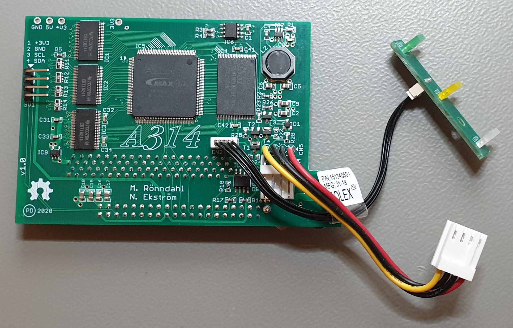

# A314-600 PCB v1.0 Autodesk EAGLE format
A314 for Amiga 600 trapdoor and LED bar

## Changelog

Initial commit of the **Amiga 600** version of the A314 board. Main differences compared to the Amiga 500 version:
 - 2MB chipRAM available as A314 shared memory (Disables the motherboard RAM)
 - Mechanical restrictions of the expansion bay implies Raspberry *Zero* form factor. The low power consumption and more generous voltage tolerances of the Zero* allowed for a simpler design, elliminating the 5V DC/DC converter (IC11 & Co.). 
 *see: https://raspberry-projects.com/pi/pi-hardware/raspberry-pi-zero/raspberry-pi-zero-hardware-general-specifications
 - Replacement LED board included. Allows for distinction between HardDrive and A314 activity on the same LED (Bi-colour)
 - Original LED overlay. If you don't want to use the included replacement LED board, then use your existing one, but connect it through the A314! Activity from the A314 is then multiplexed (or:ed) with harddrive activity using the existing HDD LED.
## Notes
This PCB has NPT milled slots with a narrow width (1.5mm) which some board houses won't accept. I have successfully used WellPCB with excellent results. Check with you favourite board house if they accept such narrow slots, before submitting a job.

You can find the belonging FPGA binaries here:
- <https://github.com/niklasekstrom/A314-500-HDL>
